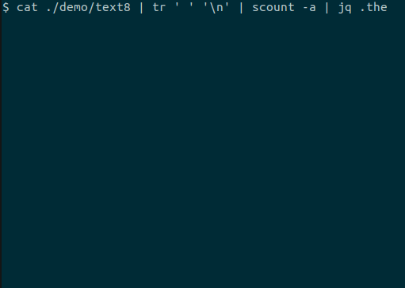

scount: a command-line streaming counter with rich progress report
==========

[](https://github.com/oshikiri/scount/actions) [](https://goreportcard.com/report/github.com/oshikiri/scount)


You can use it instead of `sort | uniq -c`.

```shell
cat ./demo/text8 | tr ' ' '\n' | scount -a | jq .the
```




## Installation
```sh
go get github.com/oshikiri/scount
go install github.com/oshikiri/scount
```

and then add `~/go/bin` to `$PATH`.


## Usage
```
$ scount -h
Usage of scount:
  -a    Use approximate counting algorithm (default is naive counting)
  -ae float
        Epsilon of lossy counting algorithm (default 1e-05)
  -as float
        Support of lossy counting algorithm (default 2e-05)
  -f int
        Flush counting progress every X [msec] (default 200)
  -n int
        Print the top N items (default 10)
  -q    Suppress a progress report
```


## Build
```sh
go build
```


## Testing
```sh
go test
```
