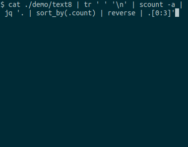

scount: a CLI streaming counter written in Go
==========

[](https://github.com/oshikiri/scount/actions) [](https://goreportcard.com/report/github.com/oshikiri/scount)




## Installation
```sh
go install github.com/oshikiri/scount
```

and then add `~/go/bin` to `$PATH`.


## Usage
```
$ scount -h
Usage of scount:
  -a    Use approximate counting algorithm (default is naive counting)
  -f int
        Flush counting progress every X [msec] (default 100)
  -n int
        Print the top N items (default 10)
  -t float
        theta of KSP algorithm (default 1e-05)
```


## Testing
```sh
go test
```

## TODO list
- [ ] UI
    - [x] Format byte (1KB -> 1MB -> 1GB)
    - [ ] barchart
        - [ ] character barchart
        - [ ] output progresses as JSON and plot barchart using d3.js
    - [ ] preserve previous command outputs (same behaviour as less command)
    - [ ] implement keybinds
        - [ ] stop updating progresses
        - [ ] quit
- [ ] fix golint warnings
- [x] Remove json_printer
- [ ] Fix approximate counting algorithm
- [ ] demo data
    - [ ] larger demo data
    - [ ] implement dummy data generator in Go
- [ ] enhancement
    - [ ] Add tuple counter (`-s` separator option)
